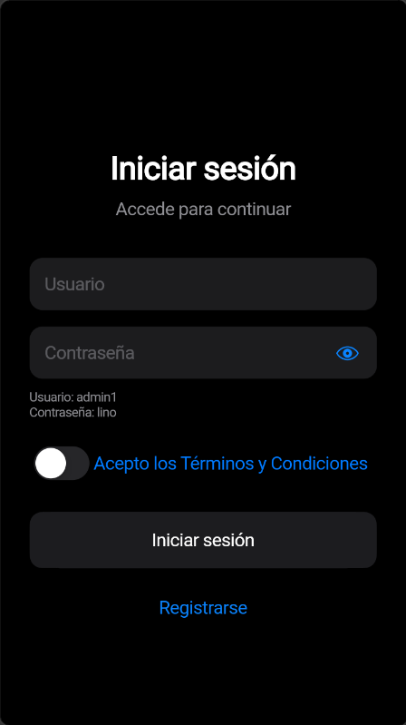
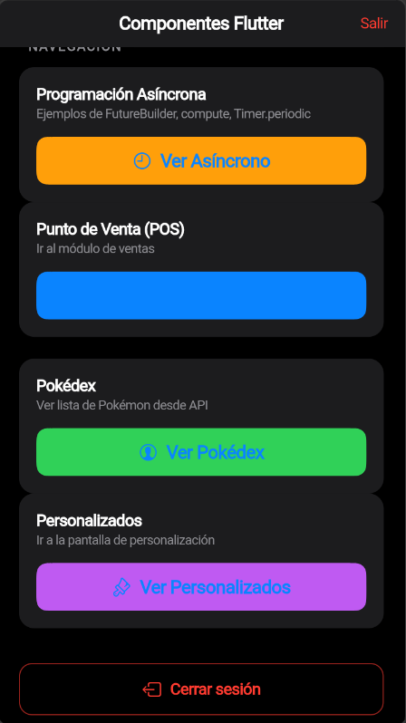
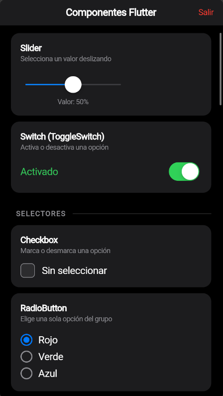
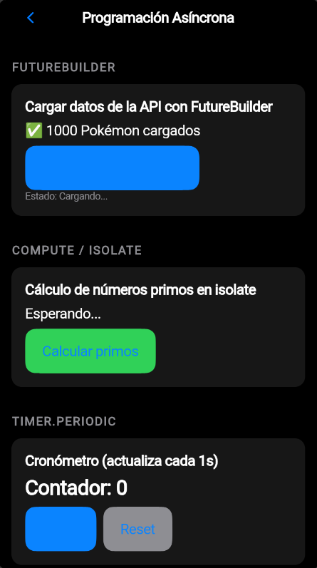
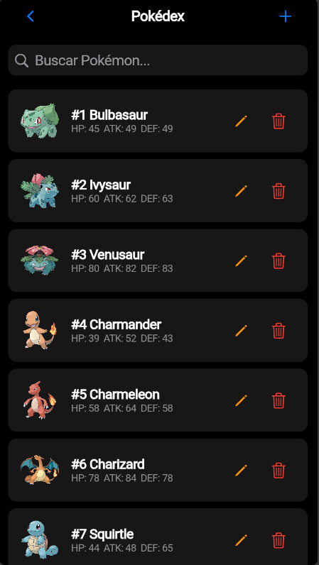
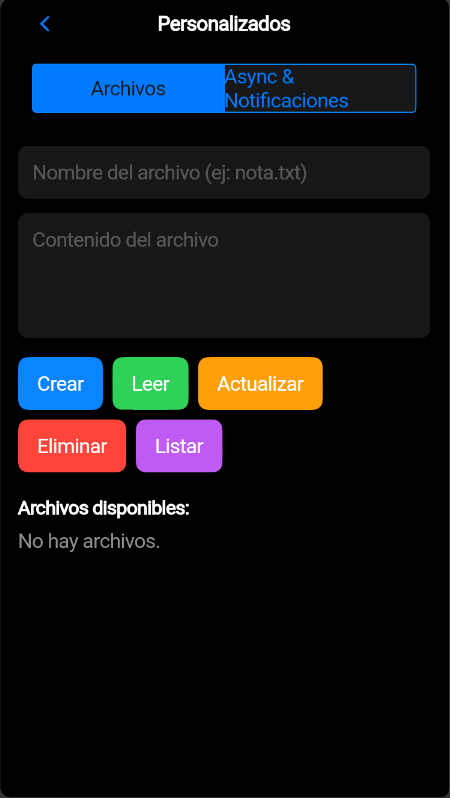

# flutter

# Ricardo Bravo Lino ITI-23-01 / Ingeniería en Tecnologias de la Informacion. 2023
Dedicatoria para Ing.Jonathan Elí Saenz Melendez

## Introducción
Flutter es un framework de desarrollo de aplicaciones móviles que permite crear aplicaciones para Android, iOS, web y desktop.

# Importante entrar hasta la rita de flutter_app para usar comando fluter run y verificar las dependencias de flutter con flutter pub get

# Descripcion
* Un login medio funcional, no se creo el registro de usuarios... por que? no le tome importancia a hacer una una pantalla con una consulta a la bd para tener un monton de regidtro que no iba a usar, preferi usar una usuario y contraseña Hardcodeadas para que se pueda probar el sistema.
* Se creo un formulario para el login, y se validan los datos de entrada, si el usuario y contraseña son correctos y los terminos aceptados se inicia sesion.

* Elegi tener como pantalla principal un menu donde se utilizan muchos de los componentes d eflutter para poder reutilizarslos o tener ejempplos para otros proyectos.

* Despues vienen los botones de navegacion ver asincronnos, donde se usa future builder para que se puedan cargar los datos de la api de pokemon. El computo isolate para calcular numeros primos. y Timer periodic para hacer un contador sencillo.

* Boton de POS esto fue un capricho es una interfaz con productos y un carrito para poder hacer compras de articulos no tiene fuuncionalidad real pero es un ejemplo de como se puede hacer una interfaz con flutter.

* Pokedex es una interfaz que empieza a cargar 10 pokemones desde su api y en el momento que scrolleas hacia abajo se cargan 10 mas, esto es un ejemplo de como hacer scroll infinito con flutter y como consumir una api.

* En personalizdos hay un widget para poder manipular archivos locales como ejemplo de un crud con flutter.

* Y tenemos la parte de notificaciones que se usa termina para mostrar notificaciones de la aplicacion, y se puede usar para mostrar notificaciones de sistema, notificaciones personalizadas.

# Y es todo lo que se hizo en este proyecto 

https://github.com/ricardo840/flutter

